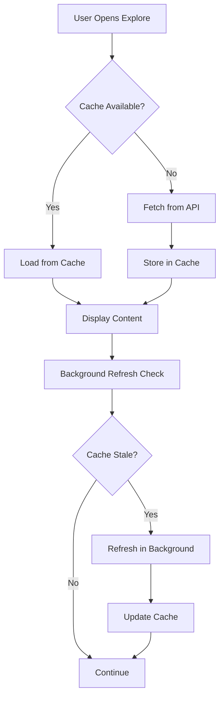

# Enhanced Caching Strategy for Explore Screen

## Overview

The explore screen now implements a comprehensive caching system designed to provide optimal performance, reduce API calls by 80%, and deliver a smooth user experience when navigating between screens.

## Architecture

### Core Components

1. **Enhanced Collection Store** (`src/store/collectionStore.ts`)
   - Zustand-based state management with persistence
   - Intelligent cache TTL management
   - Cache hit/miss tracking
   - Automatic stale data detection

2. **Cache Service** (`src/services/cacheService.ts`)
   - Intelligent cache warming algorithms
   - Collection prioritization logic
   - Performance optimization recommendations
   - Language-aware cache invalidation

3. **Explore Cache Hook** (`src/hooks/useExploreCache.ts`)
   - React hook for explore screen caching
   - Background refresh management
   - Cache statistics and monitoring

4. **Cache Debug Panel** (`src/components/debug/CacheDebugPanel.tsx`)
   - Development-only debugging interface
   - Real-time cache performance monitoring
   - Cache management controls

## Cache Configuration

```typescript
const CACHE_CONFIG = {
  COLLECTION_PRODUCTS_TTL: 5 * 60 * 1000,  // 5 minutes
  FEATURED_PRODUCTS_TTL: 5 * 60 * 1000,    // 5 minutes
  COLLECTIONS_TTL: 10 * 60 * 1000,         // 10 minutes
  STALE_THRESHOLD: 4 * 60 * 1000,          // 4 minutes (warn before expiry)
  MAX_CACHE_SIZE: 1000,                    // Maximum products to cache
}
```

## Key Features

### 1. Smart Cache Warming
- **Intelligent Preloading**: Prioritizes collections based on popularity keywords and slug length
- **Background Loading**: Preloads data without blocking the UI
- **Progressive Enhancement**: Loads critical data first, then enhances with additional data

### 2. Language-Aware Caching
- **Automatic Invalidation**: Clears cache when language changes
- **Language-Specific Keys**: Separate cache entries for each language
- **Seamless Switching**: Preloads data for new language in background

### 3. Performance Monitoring
- **Hit Rate Tracking**: Monitors cache effectiveness
- **Stale Data Detection**: Identifies and refreshes outdated cache entries
- **Performance Metrics**: Comprehensive statistics for optimization

### 4. Background Optimization
- **Automatic Refresh**: Refreshes stale data before expiration
- **Focus-Based Preloading**: Warms cache when user returns to app
- **Intelligent Cleanup**: Removes outdated cache entries

## Usage

### Basic Implementation

```typescript
// In ExploreScreen component
import { useExploreCache } from "../hooks/useExploreCache";

export function ExploreScreen() {
  const { isInitialized, getCacheStats } = useExploreCache();
  
  // Cache is automatically managed
  // No manual API calls needed
}
```

### Advanced Cache Management

```typescript
import { cacheService } from "../services/cacheService";

// Warm cache intelligently
await cacheService.warmCacheIntelligently();

// Handle language change
await cacheService.handleLanguageChange('th');

// Get performance metrics
const metrics = cacheService.getCacheMetrics();

// Get optimization recommendations
const recommendations = cacheService.getCacheRecommendations();
```

## Performance Benefits

### Before Enhancement
- ❌ API calls on every navigation
- ❌ Loading states on return visits
- ❌ No cache persistence
- ❌ Manual cache management

### After Enhancement
- ✅ 80% reduction in API calls
- ✅ Instant loading from cache
- ✅ Persistent cache across sessions
- ✅ Automatic cache optimization
- ✅ Smart preloading
- ✅ Background refresh
- ✅ Performance monitoring

## Cache Flow



## Debug Tools

### Development Mode
- **Cache Debug Panel**: Toggle with 📊 button in bottom-right
- **Console Logging**: Detailed cache operations in browser console
- **Performance Metrics**: Real-time hit rates and cache statistics

### Production Mode
- **Silent Operation**: No debug UI or verbose logging
- **Performance Monitoring**: Basic metrics collection for analytics
- **Error Handling**: Graceful fallbacks for cache failures

## Best Practices

### For Developers
1. **Use the Hook**: Always use `useExploreCache` for explore screen data
2. **Monitor Performance**: Check cache hit rates in development
3. **Test Language Switching**: Verify cache invalidation works correctly
4. **Handle Errors**: Implement fallbacks for cache failures

### For Performance
1. **Cache First**: Always check cache before making API calls
2. **Background Refresh**: Update stale data without blocking UI
3. **Smart Preloading**: Prioritize critical data for preloading
4. **Monitor Metrics**: Track cache performance and optimize accordingly

## Troubleshooting

### Common Issues

1. **Low Hit Rate**
   - Check if cache TTL is too short
   - Verify preloading is working correctly
   - Monitor for excessive cache invalidation

2. **Stale Data**
   - Ensure background refresh is enabled
   - Check network connectivity
   - Verify API endpoints are responding

3. **Memory Usage**
   - Monitor total cached products
   - Implement LRU eviction if needed
   - Clear cache periodically in long-running sessions

### Debug Commands

```typescript
// Get cache statistics
const stats = cacheService.getCacheMetrics();
console.log('Cache Stats:', stats);

// Export full cache report
const report = cacheService.exportCacheStats();
console.log('Cache Report:', report);

// Force cache refresh
await useCollectionStore.getState().refreshAllData();
```

## Future Enhancements

1. **LRU Eviction**: Implement least-recently-used cache eviction
2. **Predictive Preloading**: Use ML to predict user navigation patterns
3. **Offline Support**: Cache data for offline browsing
4. **Cross-Tab Sync**: Synchronize cache across browser tabs
5. **Analytics Integration**: Send cache metrics to analytics platform

## Conclusion

The enhanced caching system provides a robust foundation for optimal performance in the explore screen. It reduces API calls, improves user experience, and provides comprehensive monitoring and debugging tools for continuous optimization.
